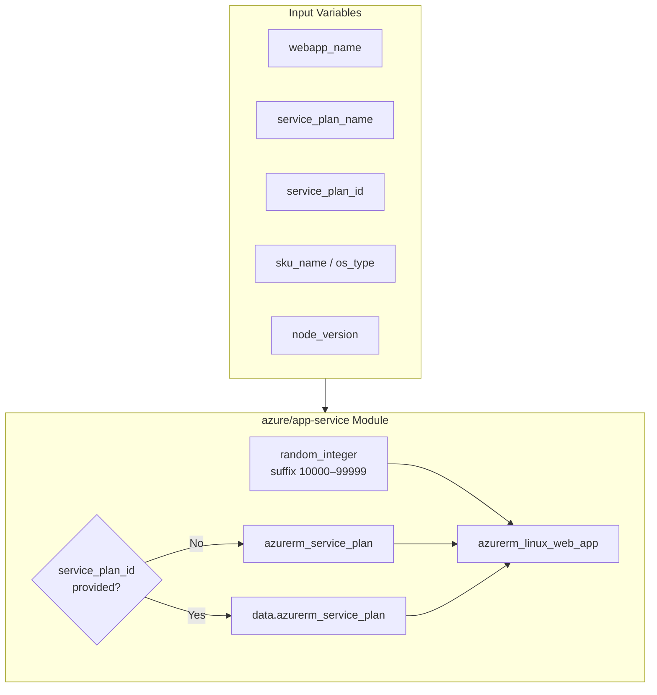

# Techem — Terraform Infrastructure Modules

> Reusable, provider-agnostic Terraform patterns for provisioning cloud infrastructure with consistency, scalability, and reliability.

---

## Overview

**Techem** is a collection of Terraform modules designed to standardize infrastructure provisioning across cloud providers. The project follows Infrastructure as Code (IaC) best practices—modular design, explicit variables, and composable resources—so teams can deploy environments repeatably with minimal drift.

The initial focus is **Microsoft Azure**, starting with an **Azure App Service** module for hosting Node.js workloads on Linux.

```
techem/
├── README.md                 # Project documentation (this file)
├── PROFILE.md                # Author profile
└── azure/
    └── app-service/          # Azure Linux Web App module
        ├── azurerm_linux_web_app.tf
        ├── azurerm_service_plan.tf
        ├── data.tf
        ├── locals.tf
        ├── random_int.tf
        ├── variables.tf
        └── outputs.tf
```

---

## Architecture

The Azure App Service module provisions a **Linux Web App** backed by an **App Service Plan**. It supports two deployment modes:

| Mode | When to use | Behavior |
|------|-------------|----------|
| **Create new plan** | Greenfield deployments | Creates `azurerm_service_plan` and attaches the web app |
| **Use existing plan** | Shared hosting / cost optimization | Looks up an existing plan via `data.azurerm_service_plan` |



### Resource details

| Resource | Purpose |
|----------|---------|
| `azurerm_service_plan` | Linux App Service Plan (SKU, OS type, region) |
| `azurerm_linux_web_app` | Node.js web application with HTTPS enforced |
| `random_integer` | Unique 5-digit suffix appended to web app name |
| `data.azurerm_service_plan` | Resolves an existing plan when `service_plan_id` is set |

### Security defaults

- **HTTPS only** — `https_only = true`
- **TLS 1.2 minimum** — configurable via `minimum_tls_version` (default: `1.2`)
- **Node.js LTS** — default runtime `20-lts`

---

## Azure App Service Module

### Prerequisites

- [Terraform](https://www.terraform.io/downloads) >= 1.0
- [Azure CLI](https://docs.microsoft.com/en-us/cli/azure/install-azure-cli) authenticated (`az login`)
- An Azure subscription with permissions to create App Service resources
- Existing resource group (passed via `service_plan_resource_group`)

### Providers

| Provider | Purpose |
|----------|---------|
| `azurerm` | Azure Resource Manager resources |
| `random` | Unique web app name suffix |

### Variables

| Variable | Type | Default | Description |
|----------|------|---------|-------------|
| `webapp_name` | `string` | — | Base name for the Linux Web App (suffix added automatically) |
| `service_plan_name` | `string` | `null` | App Service Plan name |
| `service_plan_id` | `string` | `null` | Existing plan ID; when set, plan creation is skipped |
| `service_plan_resource_group` | `string` | — | Resource group for the plan and web app |
| `app_service_location` | `string` | `"East US"` | Azure region |
| `os_type` | `string` | — | OS type for the service plan (e.g. `Linux`) |
| `sku_name` | `string` | — | App Service Plan SKU (e.g. `B1`, `P1v3`) |
| `minimum_tls_version` | `string` | `"1.2"` | Minimum TLS version for the web app |
| `node_version` | `string` | `"20-lts"` | Node.js runtime version |

### Usage examples

#### Create a new App Service Plan and Web App

```hcl
module "app_service" {
  source = "./azure/app-service"

  webapp_name                 = "my-node-app"
  service_plan_name           = "asp-my-node-app"
  service_plan_resource_group = "rg-my-app"
  app_service_location        = "West Europe"
  os_type                     = "Linux"
  sku_name                    = "B1"
  node_version                = "20-lts"
}
```

#### Attach to an existing App Service Plan

```hcl
module "app_service" {
  source = "./azure/app-service"

  webapp_name                 = "my-node-app"
  service_plan_name           = "existing-asp"
  service_plan_id             = "/subscriptions/.../resourceGroups/rg-my-app/providers/Microsoft.Web/serverfarms/existing-asp"
  service_plan_resource_group = "rg-my-app"
  os_type                     = "Linux"
  sku_name                    = "B1"
}
```

### Naming convention

Web apps are named `{webapp_name}-{random_suffix}` where the suffix is a random integer between **10000** and **99999**. This reduces naming collisions across environments and repeated applies.

### Outputs

| Output | Description |
|--------|-------------|
| `web_app_id` | ID of the Linux Web App |
| `web_app_name` | Name of the Linux Web App |
| `web_app_default_hostname` | Default hostname of the Linux Web App |
| `service_plan_id` | ID of the App Service Plan |

### Consuming this module

#### From Terraform Registry (after publishing)

```hcl
module "app_service" {
  source  = "melvinsatheesan/terraform-techem-multicloud/azurerm"
  version = "1.0.0"

  webapp_name                 = "my-node-app"
  service_plan_name           = "asp-my-node-app"
  service_plan_resource_group = "rg-my-app"
  os_type                     = "Linux"
  sku_name                    = "B1"
}
```

#### From Git (works today)

```hcl
module "app_service" {
  source = "git::https://github.com/melvinsatheesan/terraform-techem-multicloud.git//azure/app-service?ref=v1.0.0"

  webapp_name                 = "my-node-app"
  service_plan_name           = "asp-my-node-app"
  service_plan_resource_group = "rg-my-app"
  os_type                     = "Linux"
  sku_name                    = "B1"
}
```

> **Note:** The GitHub repository is `terraform-techem-multicloud` (not `techem`). Registry source `melvinsatheesan/techem/azurerm` will not work.

---

## Design principles

1. **Modularity** — Each cloud service lives in its own directory under the provider namespace (`azure/`, future: `aws/`, `gcp/`).
2. **Flexibility** — Support both create and reuse patterns for shared infrastructure like App Service Plans.
3. **Sensible defaults** — HTTPS, TLS 1.2, and Node LTS out of the box.
4. **Explicit configuration** — All environment-specific values flow through variables, not hardcoded literals.

---

## Roadmap

| Provider | Module | Status |
|----------|--------|--------|
| Azure | App Service (Linux / Node.js) | In progress |
| Azure | Additional services | Planned |
| AWS | — | Planned |
| GCP | — | Planned |

---

## Contributing

1. Fork the repository and create a feature branch.
2. Follow existing naming and file layout conventions.
3. Keep modules focused—one logical service per module directory.
4. Document new variables and outputs in the module README or this file.

---

## Author

**Melvin Satheesan** — Site Reliability Engineer with 15+ years of experience in cloud automation, IaC, and DevOps.

See [PROFILE.md](./PROFILE.md) for full professional background, or visit [melvins.me](https://melvins.me).

---

## License

This project is maintained as part of the NewVista Terraform modules collection. Refer to repository-level licensing for terms of use.
